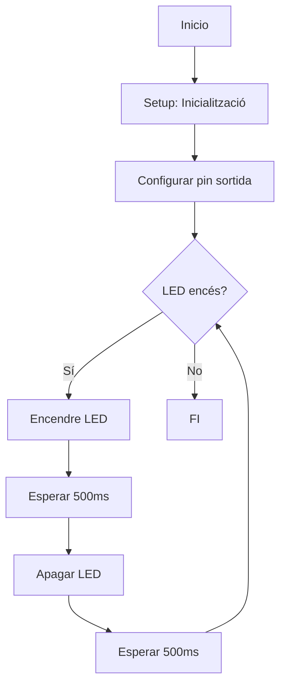
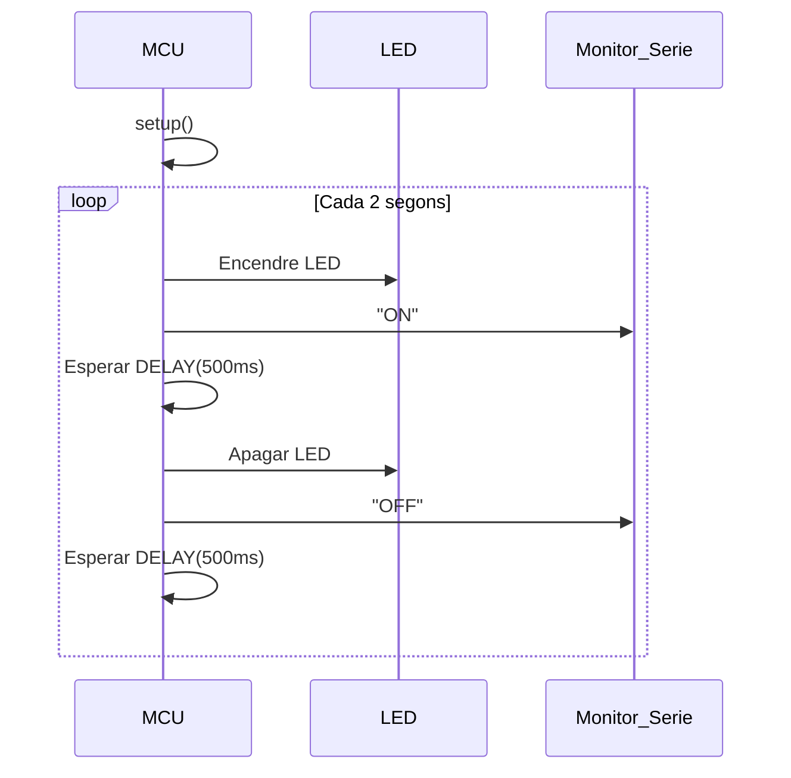

# P1_AlexandrePascual_MartiFrigola
Participants: Alexandre Pascual i Marti Frigola

## **_Codi Base_**

Aquest es el codi sobre el qual treballarem:

```c++
#include <Arduino.h>
//Definim un retard i el pin per conectar el LED
#define LED_BUILTIN 2
#define DELAY 500

//Definim el pin LED com el pin de sortida
void setup() {
  pinMode(LED_BUILTIN, OUTPUT);
}
//Al bucle es veu que només cal canviar la intensitat d’alt a baix. Ho fem amb un digitalwrite que assigna HIGH o LOW al pin de sortida.

//Afegim un delay per controlar la frecuencia.
void loop() {
  digitalWrite(LED_BUILTIN, HIGH);
  delay(DELAY);
  digitalWrite(LED_BUILTIN, LOW);
  delay(DELAY);
}


```

## **Codi del punto 1.1: Modificació impressió ON-OFF**

```c++
#include <Arduino.h>

#define LED_BUILTIN 2
 //Mantennim la definició del PIN out.

#define DELAY 1000
//Pujem el Delay a 1

void setup() {
Serial.begin(115200);
//Es defineix una velocitat de comunicació serial a 115200 bits per segon per motius de bona transmissió de la informació

pinMode(LED_BUILTIN, OUTPUT);

}

void loop() {
    
digitalWrite(LED_BUILTIN, HIGH);
Serial.println("ON");
//Quan la intensitat augmenti s'imprimirà ON.

delay(DELAY);
digitalWrite(LED_BUILTIN, LOW);
Serial.println("OFF");
//I quan disminueixi, imprimirà OFF.

delay(DELAY);
}
```

## **Punt 1.3:**
```c++
#include <Arduino.h>

#define LED_BUILTIN_PIN 2
#define DELAY 1000 // ms

//Establir un punter al registre de sortida GPIO

volatile uint32_t *gpio_out = (uint32_t *)GPIO_OUT_REG;

void setup() {
    Serial.begin(115200);  // Inicializa la comunicación serie
    pinMode(LED_BUILTIN_PIN, OUTPUT); // Configura el pin como salida
}

void loop() {
    // El LED s'encendrà quan s'activi el bit corresponent.
    *gpio_out |= (1 << LED_BUILTIN_PIN);
    Serial.println("ON");
    delay(DELAY);

    // El LED s'apagarà quan s'alteri l'estat del bit corresponent.
    *gpio_out ^= (1 << LED_BUILTIN_PIN);
    Serial.println("OFF");
    delay(DELAY);
}
```

## **Punt 1.4: Mesura amb oscil·loscopi i freqüència màxima:**

### **1.4.1: Amb l’enviament pel port sèrie del missatge i fent servir les funcions d’Arduino
**

EL led de sortida sera el 2.
Ens dona una freqüència de sortida de 18,36 KHz.

```c++
#include <Arduino.h>

#define TEST_PIN 2 
volatile uint32_t *gpio_out = (uint32_t *)GPIO_OUT_REG;

void setup() {

    Serial.begin(115200);
    pinMode(TEST_PIN, OUTPUT);
}
void loop() {

    // ===== CAS 1: Amb Serial i funcions d'Arduino =====
    digitalWrite(TEST_PIN, HIGH);
    Serial.println("ON");
    digitalWrite(TEST_PIN, LOW);
    Serial.println("OFF");
  
}

```
### **1.4.2: Enviament per el port serie i accedint als registres**

Freqüència mesurada: 18,27 KHz.
```c++
#include <Arduino.h>

#define TEST_PIN 2  
volatile uint32_t *gpio_out = (uint32_t *)GPIO_OUT_REG;

void setup() {
    Serial.begin(115200);
    pinMode(TEST_PIN, OUTPUT);
}
void loop() {
        // ===== CAS 2: Amb Serial i accés a registres =====
    *gpio_out |= (1 << TEST_PIN);
    Serial.println("ON");
    *gpio_out ^= (1 << TEST_PIN);
    Serial.println("OFF");

}
```
### **1.4.3: Sense enviament pel port sèrie i utilitzant les funcions d'Arduino**

Freqüència aproximada: 1,250 MHz.
```c++
#include <Arduino.h>

#define TEST_PIN 2 
volatile uint32_t *gpio_out = (uint32_t *)GPIO_OUT_REG;

void setup() {
    Serial.begin(115200);
    pinMode(TEST_PIN, OUTPUT);
}

void loop() {
    // ===== CAS 3: Sense Serial i funcions d'Arduino =====
    digitalWrite(TEST_PIN, HIGH);
    digitalWrite(TEST_PIN, LOW);
}
```
### **1.4.4: Sense enviament pel port sèrie y accedint directament als registres**

Freqüència de sortida: 3,50 MHz
```c++
#include <Arduino.h>

#define TEST_PIN 2 
volatile uint32_t *gpio_out = (uint32_t *)GPIO_OUT_REG;

void setup() {
    Serial.begin(115200);
    pinMode(TEST_PIN, OUTPUT);
}

void loop() {
    // ===== CAS 4: Sense Serial y accés a registres =====
    *gpio_out |= (1 << TEST_PIN);
    *gpio_out ^= (1 << TEST_PIN);
}

```
## **Punt 1.5: Diagrames de flux i temps**
### **1.5.1- _Diagrama de flux_**



### **1.5.2- _Diagrama de temps_**


## **Punto 1.6**

**Temps lliure del processador = Temps total del cicle - Temps execució del bucle**


## **Punto 1.7: Exercicis voluntaris DE MILLORA DE NOTA**
Llegir la temperatura interna i treure-ho per el port sèrie.

Vam utilitzar la llibreria Adafruit Neopixel amb la que vam poder realitzar l'exercici, ens ho va recomanar el professor.
En el document Platformio.ini está inclosa la llibreria Adafruit Neopixel
```c++
; PlatformIO Project Configuration File
;
;   Build options: build flags, source filter
;   Upload options: custom upload port, speed and extra flags
;   Library options: dependencies, extra library storages
;   Advanced options: extra scripting
;
; Please visit documentation for the other options and examples
; https://docs.platformio.org/page/projectconf.html

[env:esp32-s3-devkitm-1]
platform = espressif32
board = esp32-s3-devkitm-1
framework = arduino
monitor_speed = 115200
monitor_port = /dev/ttyUSB*
lib_deps = adafruit/Adafruit NeoPixel@^1.12.4
```
**_Exercici Temperatura_**
Em fet que no només ens apareixi la temperatura en la sortida, sinò que també apareixerà un color en cas de que connectem LEDs a la placa.

```c++
  #include <Adafruit_NeoPixel.h>
  #include <Arduino.h>
  
  // Definir el pin i numero de NeoPixels
  #define PIN            6
// Es defineixen els 16 de LEDs que utilitzaríem.
//Està preparat per retornar un  color segons la temperatura.
  #define NUMPIXELS     16
  #define DELAYVAL      500  // Tiempo (en milisegundos) para la pausa entre pixeles
  
  // Inicialtizar l'objecte de la llibreria NeoPixel
  Adafruit_NeoPixel pixels(NUMPIXELS, PIN, NEO_GRB + NEO_KHZ800);
  
  // Definir el rang de temperatura
  #define MIN_TEMP 0    // Temperatura mínima en °C (en este caso, 0°C)
  #define MAX_TEMP 40    // Temperatura máxima en °C (en este caso, 40°C)
  
  void setup() {
    Serial.begin(115200);  // Inicializa la comunicación serie
    pixels.begin();        //  Inicializa la tira de LEDs.
    analogReadResolution(12);  // Establece la resolución del ADC a 12 bits, lo que permite leer valores entre 0 y 4095.
  }
void loop() {
    // Llegeix el valor del sensor de temperatura
    int rawValue = analogRead(0);  // Lee el valor del sensor de temperatura interno
    float voltage = (rawValue / 4095.0) * 3.3;  // Convierte el valor ADC a voltaje
  
    // Fórmula per convertir el voltatge a temperatura (en °C)
    float temperature = (voltage - 0.5) * 100;  // Convierte el voltaje a temperatura en grados Celsius
  
    // Comproba que la temperatura apareixi segons el rang especificat
    if (temperature < -40 || temperature > 125) {
      temperature = 24.6;  // Si la temperatura esta fora del rang, li dona aquest valor com a general
    }
    
    // Mostrar la temperatura 
    Serial.print("Temperatura interna: ");
    Serial.print(temperature);
    Serial.println(" °C");


//Aquesta part de colors no va poder ser aplicada al laboratori, pero aquí deixo una petita explicació per parts del que fa el programa.

    // Calcula el color basant-se en la temperatura(mapegem la temperatura entre MIN_TEMP y MAX_TEMP)
    int colorValue = map(temperature, MIN_TEMP, MAX_TEMP, 0, 255);  // Mapea la temperatura a un valor entre 0 y 255
    
    // Si la temperatura está per sota el rang, serà blau
    if (colorValue < 0) {
      colorValue = 0;
    }
  
    // Si la temperatura sobrepasa el rang, serà vermell
    if (colorValue > 255) {
      colorValue = 255;
    }
  
    // Asignar colors a cada pixel (verd a vermell)
    for(int i = 0; i < NUMPIXELS; i++) {
      // Mapea el color entre verde (frío) y rojo (caliente)
      int r = colorValue;    // Color Rojo
      int g = 255 - colorValue; // Color Verde (invertido)
      int b = 0;              // Azul (no utilizado en este caso)
  
      pixels.setPixelColor(i, pixels.Color(r, g, b));  // Ajustar color del pixel
    }
    
    pixels.show();  // Mostrar la actualización en los NeoPixels
    delay(DELAYVAL);  // Pausa de 500ms antes de la siguiente actualización
  }
```
El resultat que ens ha donat ha sigut de 25 ºC aproximadament. Amb aquest valor, podem suposar que el programa esta funcionant correctament.

